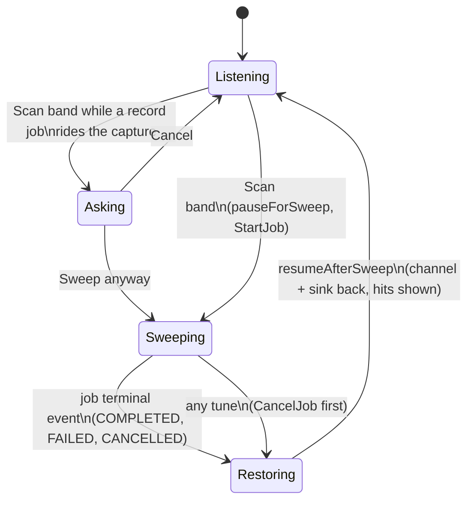

# Plan: Bands, channels and bookmarks

Status: implemented 2026-09-29. All seven units and the review follow-up are on `main`, the whole
gate is green, and `app.md` holds the remaining Mac acceptance checklist. Implements
`../design/channels.md` as APP-9 in `app.md`, E.4 in `build-order.md`; the unit detail below is the
execution record.

---

## Goal Capsule

- **Objective.** A newcomer with an RTL-SDR opens the app, clicks a band, clicks Scan band and
  hears the local NOAA transmitter without typing a frequency; types `ch5` and is on GMRS channel
  5; a ham imports a CHIRP export and finds the memories filed under 2 m and 70 cm with their
  tones, in the app and in `ley bookmarks`, without the sidebar becoming a hundred rows.
- **Means.** The design's six steps, in its order (KTD1 to KTD14 below own the how).
- **Authority.** The design doc governs product behaviour; this plan governs implementation; the
  invariants in `AGENTS.md` and the style pages under `docs/dev/` govern both. Where a unit and
  the design disagree, the design wins and the unit is wrong.
- **Stop conditions.** A change that would need a proto edit, a daemon change, or a new
  dependency in `app/Package.swift` or `go/go.mod` stops the run: none is planned, and each is a
  design question. A gate in the Verification Contract that cannot be made green in the
  container stops the unit, not the run: the unit is reported with the red gate named.
- **Execution profile.** One unit at a time, in U-ID order; each unit ends in one commit on
  `main` (the repo's rule: no branches, no PRs), signed off, with the Mac checklist in its body.
- **Who finishes.** The agent finishes every unit's Linux-verifiable work; the owner runs the
  accumulated Mac checklist in `app.md` under APP-9 afterwards, and fixes from that are new
  items, not this plan's.

---

## Product Contract

### Summary

Plan channels become a `channels` list on each band in the Go table and the app's seed file, and
`ley presets` becomes a view over them. The sidebar is rebuilt with bands as the spine: bookmarks
nest under their band, a group is one row, out-of-range bands fold to one line, a filter field
flattens everything, and a picker lists a band's plan. Scan band runs the daemon's scan job
against the window's own radio and puts the hits on the rail. Bookmarks gain tone, note and tags
in the file, the inspector and `ley bookmarks`. CHIRP CSV imports into that file from both
clients. Both bookmark stores first learn to keep keys they do not know, so neither client can
strip the other's fields.

### Problem Frame

The window conflates three kinds of frequency. `ley` knows NOAA's and GMRS's channels as presets
the app cannot see; the app's bookmarks are a flat list that a CHIRP import would flood; the
newcomer stories in `user-stories.md` promise "hear something real within seconds" and the sidebar
cannot deliver it. The design doc has the full context and the decisions.

### Requirements

**Plans and the tables**

- R1. Each band in `go/pkg/leyline/bands.go` may carry a `channels` list: name, aliases, hz, note,
  and optional mode, bandwidth and decoder; `ley bands --json` and the app's seed
  `app/Sources/LeylineClient/Resources/bands.json` carry it, and the existing drift test holds
  the seed to the table.
- R2. A channel's name is what the service's radios print (`WX3`, `16`, `19`, `1`; GMRS keeps
  `ch17` and its repeater aliases); every entry also has a plan-prefixed alias (`wx3`,
  `marine16`, `cb19`, `murs1`, `gmrs17`) that resolves without a band; a bare numeric name
  resolves only in band context; marine duplex pairs are `24` and `24 coast`.
- R3. The alpha plans are those in the design's table: NOAA WX1 to WX7, GMRS 1 to 22 with the
  repeater aliases, MURS 1 to 5, the full ITU marine plan with the US A and B variants and ship
  and coast entries, CB 1 to 40, 2 m calling and APRS (`decoder: aprs`), airband guard. MURS is
  two padded halves and a `murs` group; 6 m and 1.25 m are added with no plan. Every frequency is
  checked against the FCC or ITU listing named in the unit before the table is committed.
- R4. `ley presets`, `ley help presets`, `ResolvePreset`, `presetAt`, `ley tune`'s and
  `ley bookmarks add`'s mode reasons, and the MCP tool descriptions read the plans; every name
  and alias the preset table has today keeps resolving to the same frequency.
- R5. `ley bands` prints a CHANNELS count column, `ley bands <name>` prints the band's plan, and
  `ley bands <name> --json` carries `channels`.
- R6. `ley tune <n> --band <band>` and `ley bookmarks add <n> --band <band>` read the
  positional as a channel name in the band's plan and nothing else; a name the plan lacks is
  an error that names the band and its plan; without `--band` a bare number stays a frequency.

**The bookmarks file**

- R7. Both bookmark stores preserve, per entry, every JSON key they do not know, through load,
  edit and save, including the Go store's update-in-place path.
- R8. A bookmark may carry `tone`, `note`, `tags`, `offset_hz` and `duplex`; `tone` accepts only
  CHIRP's spellings (a CTCSS tone as `100.0`, a DCS code as `D023N` or `D023I`) and both clients
  refuse anything else with the same error line.
- R9. `ley bookmarks add` takes `--tone`, `--note` and repeatable `--tag`; the list takes `--tag`
  and shows TONE, NOTE and TAGS columns only when some bookmark has them; `--json` carries the
  fields; the JSON shape is documented in `docs/reference/cli.md`.

**The sidebar**

- R10. The sidebar is one list of bands in frequency order; a band click tunes as today and the
  tuned band is the expanded one; a chevron expands or collapses without tuning; an expanded band
  shows its range line, a compact raised action strip, the sweep outcome and its bookmarks.
- R11. A group replaces its parts as one row: its picker is the group's plan, its bookmarks are
  those in either part, Scan band sweeps the group, a pick tunes through the part that
  contains the channel, and the rail keeps showing the part the capture is on with only that
  part's channels ticked.
- R12. Bands the radio cannot tune fold to one dim line, `7 bands below what this radio tunes`
  (`outside` when they lie on both sides), which expands on click; their bookmarks appear in the
  filter as disabled rows.
- R13. A filter field at the top narrows the list to bands, bookmarks and plan channels whose
  name or alias matches; the order is the tuned band's matches first, then frequency order, a
  bookmark before a plan channel on the same frequency; Return tunes the first row, a band row
  as a click would; disabled rows are listed and skipped; `No matches for "…"` replaces an empty
  list; Escape clears and blurs; `Go to…` (⌘G) in the Tune menu focuses it.
- R14. `Channels…` in the action strip opens a popover of the plan, about twelve rows tall and
  scrolling, each row the channel's name, frequency and note, in plan order, with a filter field
  for the long plans
  and arrow keys and Return to pick; a pick tunes and closes.
- R15. A plan of 24 channels or fewer is drawn as faint ticks on the band rail.
- R16. A bookmark or tuned frequency on a plan channel shows the channel's name in the
  frequency's place; a bookmark made by ⌘D, by the inspector's pencil, by a scan hit's ＋ or by
  a blank-named CHIRP row is named after the channel it sits on, else after the frequency.

**Scan band**

- R17. The band row's context menu and expanded row carry Scan band, which starts
  `ScanConfig{range: the band or group, once, take_over, device_id: the window's capture's
  device}`; the row reads `Sweeping <band>, <n> steps…` from the job's status detail; hits land
  on the rail as ticks with the name or frequency and SNR in the help text and in the expanded
  row strongest first; a click on a hit tunes it and ＋ bookmarks it (R16's naming).
- R18. Before the job the window detaches its sink and destroys its channel, keeps the capture
  and the displayed frequency, and ignores the borrowed capture's centre events; on the job's
  terminal event it recreates the channel and sink by the band-select path and re-applies the
  bookmark's or band's settings.
- R19. A sweep that finds nothing shows `Nothing on the air right now; repeaters and towers key
  up briefly`; a failed job shows its status detail in `caution`; a `covered` range narrower
  than the band appends `ley scan`'s coverage note; hits in the gap between a group's halves are
  dropped; a previous sweep's hits stay until the next sweep or the next tune elsewhere.
- R20. A recording running on the window's capture makes Scan band ask first, on the existing
  move alert, with Sweep anyway and Cancel; any tune while the row reads `Sweeping…` cancels the
  job and proceeds after its terminal event; Scan band reads Stop while it runs; with no
  capture at all the job runs on the picked device and the band is selected afterwards.

**The inspector**

- R21. The identity region edits `tone` and `note` beside the name, shows the heard tone beside
  the bookmark's tone without calling a difference a mismatch, and shows `tags` as words under
  the name; the changed-from-the-bookmark rule keeps comparing mode and width only.

**CHIRP import**

- R22. `ley bookmarks import <file.csv> [--dry-run] [--json]` and `File > Import CHIRP…` read
  CHIRP's CSV export into the bookmarks file with the design's column mapping and the tone
  mapping per CHIRP mode (`Tone`, `TSQL`, `DTCS`, `Cross`); `offset_hz` and `duplex` are
  written as fields; the file's basename becomes a tag; the verb prints and the app notices
  what was added, updated and skipped; a file with no `Frequency` header is refused and
  nothing is written; a row with an unparseable frequency is skipped and counted.
- R23. An import updates a bookmark that already exists on the row's frequency under the row's
  name; a blank field never clears an existing value; `tags` is a set; a blank `Name` takes
  R16's naming; frequencies round to whole hertz; USB, LSB, CW and WFM map directly and other
  modes fall to the band's default.
- R24. Both parsers are held to one fixture CSV and one expected bookmarks file in `fixtures/`.

**Documentation and hand-off**

- R25. Every unit that changes `ley`'s output re-records its goldens, updates
  `docs/reference/cli.md`, `docs/guide/using-ley.md` where it names presets, and the
  `## Unreleased` bullet in `CHANGELOG.md`; the bookmark shape in
  the M1 design handoff and `docs/dev/app.md` follows the file.
- R26. Every unit that touches `app/Sources/LeylineApp` ends with the by-eye checklist from
  `docs/dev/swift-style.md` section 12 applied to the diff and a Mac checklist appended under
  APP-9 in `app.md`; the run continues to the next unit without waiting for it.

### Key Decisions

- **The design doc's decisions stand as reviewed on 2026-09-28** (session-settled: user-approved,
  the eleven review fixes applied as one batch). Governs R1 to R21.
- **No MCP bookmarks tool in alpha** (session-settled: user-approved; chosen over adding it to
  APP-9e's acceptance: no story asks for it). Governs R4.
- **Marine ships its full plan** (session-settled: user-approved; chosen over the dozen US
  channels). Governs R3.
- **Out-of-range bands are one line and the `Bands…` sheet is deferred** (session-settled:
  user-approved; chosen over building the sheet). Governs R12; see Scope Boundaries.
- **A running recording asks; a tune cancels a sweep** (session-settled: user-approved; chosen
  over refusing Scan band or leaving the tune to fail). Governs R20.
- **New bookmarks are named after the plan channel they sit on** (session-settled:
  user-approved; chosen over the frequency). Governs R16.
- **A re-import never clears a typed value** (session-settled: user-approved; chosen over
  overwrite). Governs R23, R24.
- **Phases proceed without Mac sign-off** (session-settled: user-approved; chosen over gating
  each unit on the owner). Governs R26.

### Acceptance Examples

- AE1. **NOAA without a frequency.** Given a radio and no bookmarks, when the newcomer clicks
  `NOAA weather`, clicks Scan band and clicks the loudest row, then the window is tuned to that
  WX channel, the row shows its name, and audio is back. Covers R10, R17, R18.
- AE2. **Channel 5 by name.** Given the filter focused, when the user types `ch5` and presses
  Return, then the window is on 462.6625 MHz, the GMRS row is expanded and the inspector's title
  reads `ch5`. Covers R13, R16.
- AE3. **A CHIRP export.** Given a CSV of 120 memories on 2 m and 70 cm, when it is imported from
  the app, then a notice reads the counts, the 2 m and 70 cm rows hold the bookmarks collapsed,
  each carries its tone and offset, and `ley bookmarks` lists the same. Covers R22, R23, R10.
- AE4. **An older `ley` and a newer file.** Given a bookmarks file the app wrote with `tone`, when
  a `ley` built after U2 but before U6 runs `ley bookmarks move`, then `tone` is still in the
  file. Covers R7.
- AE5. **A sweep over a recording.** Given a recording running on the tuned channel, when the
  user clicks Scan band, then an alert offers Sweep anyway and Cancel and nothing has started.
  Covers R20.

### Scope Boundaries

- **Deferred for later**, from the design's "Deliberately not in alpha": lists and scan lists,
  repeater pairs, usage ordering, regional plans, editing the band table in the app, bookmarks in
  the daemon, and the MCP bookmarks tool.
- **Deferred to follow-up work** (plan-local): the `Bands…` sheet with its per-band checkboxes;
  `--band` on verbs other than `tune` and `bookmarks add`; the decoder offer on a data channel
  (`Start decoding` on APRS); showing `offset_hz` anywhere.
- **Not this plan's**: the two Mac measurements and every finding of the owner's Mac pass,
  which become new items under APP-9.

### Sources

- `docs/design/channels.md`: every decision above.
- The M1 design handoff, "Bands and bookmarks are files" (now in `docs/design/channels.md`) and
  "Decided 2026-09-21: the sidebar": the file layer and the selection rule the units keep.
- `docs/design/scan.md`, "Don't-disturb" and "Geometry": what a sweep does to the radio.
- `engine/Sources/LeylineDaemon/Jobs/SessionCaptureAllocator.swift`: the reuse step borrows the
  window's capture on its own id and restores it on release; `DEVICE_SWEEPING` refuses writes
  meanwhile.
- `go/internal/eval/daemon.go`, the fixture re-centring: copy the `.cf32` beside a rewritten
  sidecar with a new `center_hz` and attach the copy.
- `docs/dev/swift-style.md` section 12: the by-eye checklist and the hand-off wording.

---

## Planning Contract

### Key Technical Decisions

- KTD1. **The printable form of a plan channel is its plan-prefixed alias.** `Preset.Name`
  becomes that alias (`wx3`, `marine16`, `cb19`, `murs1`; GMRS keeps `ch17`), so `presetAt`'s
  CHANNEL column, `ley tune`'s reason line and the MCP text print one unambiguous word; the
  radio-printed name (`WX3`, `16`) is the first entry of `Aliases` and is what the app shows.
  `Preset` gains `BandwidthHz` for the channels that override the band's width. Governs R2, R4.
- KTD2. **One tolerance for "on a channel": the nearest channel within 6 kHz**, in Go (`presetAt`
  today) and in the Swift lookup, rather than half the band's step: CB's 10 kHz spacing and
  GMRS's 12.5 kHz both resolve to the nearer channel, and the two clients agree. Two entries at
  equal distance, which marine's US variants make common (`22A` and `22` share 157.100 MHz,
  `87B` and channel 87's coast entry share 161.975 MHz), resolve to the earlier entry in plan
  order in both languages, and U3 enters the US variant before the ITU entry that shares its
  frequency. Governs R16.
- KTD3. **Unknown keys ride in an extra map.** Go: `Extra map[string]json.RawMessage` tagged
  `json:"-"`, filled at `Open` from a second decode of each entry, merged into the entry's map at
  save with the known keys winning, and carried across `Add`'s update-in-place; the struct is no
  longer comparable, so the test that compares with `!=` moves to field comparison. Swift: a
  `JSONValue` enum in `LeylineClient` (`Hashable`, `Codable`) and `extra: [String: JSONValue]` on
  `Bookmark`, decoded through a dynamic-key container and encoded after the known fields.
  Governs R7.
- KTD4. **The sidebar's list is a fold, not the table.** `Bands.sidebar` in `LeylineClient` folds
  each group's parts into the group row. The fold is read by the sidebar and the filter only:
  `AppSession` keeps its part-only list (`Bands.plain`) for `band(containing:)`,
  `defaultMode(at:)`, `tune(bookmark:)` after Stop listening and the last-band adoption, since
  those lookups never answer a group; `select(band:at:)` still takes a part, and a part maps to
  its group only where a row is expanded. Governs R11.
- KTD5. **Scan band pauses the window without releasing the capture.** A `pauseForSweep()` on
  `AppSession` detaches the sink and destroys the channel, sets a `sweeping` flag that the
  mirror-follow, `bandMoveWords` and the failure words respect, and keeps the capture; a
  `followScanJob()` in the mirror-follow list watches the job to its terminal state, fetches the
  `Scan`, and calls `resumeAfterSweep()`, which re-runs the band or bookmark select. `stopListening`
  is not reused: it destroys the capture the window created. Governs R17 to R20.
- KTD6. **Filter matching is a case-insensitive prefix match on name and alias tokens**, ordered
  tuned band first, then the sidebar's frequency order, a bookmark before a plan channel on the
  same frequency; the match and order live in `LeylineClient` (`SidebarIndex`) so they are
  tested on Linux. Governs R13.
- KTD7. **One naming function.** `Plans.name(at:in:)` in `LeylineClient` answers the channel's
  radio-printed name within KTD2's tolerance, else nil; `bookmarkCurrent`, `renameTuned`'s add
  path, a scan hit's ＋ and the CHIRP blank-name rule all go through it (session-settled:
  user-approved, see Key Decisions). Governs R16.
- KTD8. **`--band` on `tune` and `bookmarks add` only.** `resolveDial` gains an optional band
  context; a bare name resolves in that band's plan first; the other dial verbs wait. Governs R6.
- KTD9. **Two CHIRP parsers, one fixture.** `go/pkg/chirp` and `LeylineClient/CHIRP.swift`
  parse the CSV into the store's own add-or-update calls; `fixtures/chirp/sample.csv` and
  `fixtures/chirp/expected.json` are diffed by both suites after ids and `updated_ns` are
  normalised; the mapping rules (R22, R23) live in the design doc and are cited, not restated.
  Governs R22 to R24.
- KTD10. **Tone spelling is validated by one rule in each language.** `leyline.ParseTone` and
  `Tone.parse` accept a CTCSS tone from the standard table formatted `%.1f` and a DCS code as
  `D` + three octal digits + `N` or `I`; the app renders a stored tone as `PL 100.0` or
  `DCS 023` through the same words `SubAudibleTone` uses. Governs R8, R21.
- KTD11. **Group hits outside the halves are dropped**, and the rail shows the tuned half's
  hits, for the reason the design gives MURS two halves. Governs R19.
- KTD12. **The filter and the picker's text fields copy `NameField`'s key monitor**, or Space
  mutes the radio and the arrows tune while the user types. Governs R13, R14.
- KTD13. **Sidebar and rail views take their data from `LeylineClient` types** (`SidebarRow`,
  `SidebarIndex`, `PlanChannel`, the hits list), so the view bodies are thin and everything with
  a rule has a Linux test. Governs R10 to R16, R26.
- KTD14. **Each unit is one commit on `main`**, subject `area: what changed`, body naming the
  files not compiled here and the behaviours unverified, signed off (session-settled:
  user-approved, see Key Decisions). Governs R26.

### High-Level Technical Design

The tables and who reads them after U3:

```mermaid
flowchart TB
  T[go/pkg/leyline/bands.go\nbands + groups + channels] --> P[presets.go\nPresets() as a view]
  T --> J[ley bands --json]
  J --> S[app seed bands.json\nheld by TestBandsJSONResource]
  P --> C1[ley tune / record / bookmarks add\nmode reason]
  P --> C2[presetAt: scan BAND cell,\nmonitor CHANNEL column]
  P --> C3[ley presets, ley help presets,\nMCP tool text]
  S --> A[LeylineClient: Bands, Plans,\nSidebarIndex]
  A --> V[LeylineApp: SidebarView,\nBandRailView, picker]
```

The band scan's lifecycle in the window after U5:



While `Sweeping`, every capture write from the window would be refused `DEVICE_SWEEPING`; the
flag keeps the window from making one.

### Assumptions

- `make fixtures` produces `scan_band.cf32` (146.0 MHz, four carriers) as `go/cmd/leyfix/
  catalog.go` says; U5's e2e depends on it.
- A running scan's status detail is `sweeping n steps` before the first hop and
  `step k/n, m found` after each, as `JobStore.swift` writes them; `Sweep.swift` reads `n` and
  `k` from those two shapes to print `Sweeping <band>, <n> steps…` and shows the detail
  verbatim when neither matches.
- The FCC and ITU listings for the marine, CB and MURS plans are read by the agent writing U3
  from the sources the unit names; a channel the sources disagree on is left out and listed in
  the commit body rather than guessed.

### Sequencing

U1 first, so the design carries the defaults every later unit cites. U2 before anything writes a
new field. U3 before U4, because the sidebar's picker, ticks and names read the seed. U4 before
U5, because Scan band lives on the band row and the group row. U6 before U7, because the
import writes the fields U6 defines. No unit is parallel with another; each is one commit.

### System-Wide Impact

- `ley`'s help goldens, `docs/reference/cli.md` and `using-ley.md` change in U3, U6 and U7.
- The bookmarks file gains fields both clients must round-trip (U2 is the guard).
- The MCP `tune`, `listen_summary` and `scan` descriptions change wording in U3; no tool is
  added and no eval scenario changes.
- `proto-check` and `license-check` must stay green untouched: no proto edit, and nothing under
  `app/` may import the engine.

### Risks

| risk | mitigation |
|---|---|
| A wrong frequency in a hand-typed plan is heard as silence on the channel a newcomer asked for | U3 names the listings, checks every entry against them, and pins each plan's count and spot frequencies in a test |
| The SwiftUI views cannot be compiled here | KTD13 keeps rules in the client library; each unit's Mac checklist names the unverified behaviours (R26) |
| The audio-gone duration of a sweep is unknown until the Mac run | U5's checklist records it; the design's item stays open until then |
| `TestPresetsAndBands` pins the last `--json bands` row as the GMRS group | U3 changes the assertion to both groups |
| The Go `Bookmark` becomes non-comparable | U2 moves the `!=` comparison to fields in the same commit |
| A sidebar text field steals Space and the arrows | KTD12 |

---

## Implementation Units

### U1. The design carries the decided defaults

- **Goal:** `docs/design/channels.md` states every rule the review's flow analysis found missing,
  so the later units cite it rather than invent it.
- **Requirements:** R12, R13, R16, R19, R20, R23, R24; Key Decisions.
- **Dependencies:** none.
- **Files:** `docs/design/channels.md`; `docs/plans/app.md` (APP-9c to APP-9f gain the new
  behaviours in one line each).
- **Approach:**
  1. "Bands are the spine of the sidebar" gains the filter's match, order, Return, Escape and
     disabled-row sentences (R13), the mixed out-of-range wording (R12), the naming rule for
     new bookmarks (R16), the picker's highlight and keys (U4 step 4), and the expanded row's
     order with Scan band in it (U5 step 4).
  2. "Scan the band" gains a "While a sweep runs" paragraph (R20, and a second band's Scan band
     cancelling the first), the failed-job and partial coverage wording and the dropped gap
     hits (R19); "The plan is data in the band table" gains KTD2's tie rule.
  3. "CHIRP import" gains the update, blank-name, rounding and mode rules (R23) and the shared
     fixture (R24); "What is remembered where" moves the `Bands…` sheet sentence to
     "Deliberately not in alpha".
  4. `docs/README.md`'s plans list names this plan.
- **Patterns to follow:** the doc's own voice per `docs/writing-guide.md`; one owner per rule.
- **Test expectation:** none, a documentation unit; `grep -rn 'docs/'` shows every cited path
  still resolves.
- **Verification:** the design doc answers every question in the flow analysis's list without
  a forward reference to this plan; the paths check passes.

### U2. Both bookmark stores keep unknown keys

- **Goal:** a field one client writes survives the other client's load, edit and save (R7).
- **Requirements:** R7; AE4.
- **Dependencies:** U1.
- **Files:** `go/pkg/bookmarks/bookmarks.go`, `go/pkg/bookmarks/bookmarks_test.go`;
  `app/Sources/LeylineClient/Bookmarks.swift`, a new `app/Sources/LeylineClient/JSONValue.swift`,
  `app/Tests/LeylineClientTests/BookmarksTests.swift`; `CHANGELOG.md`.
- **Approach:** KTD3. Both tests use the same literal JSON fixture string, an entry with
  `"tone": "100.0"`, `"lists": ["x"]` and `"zzz": {"a": 1}`, so the two stores are held to one
  file by inspection. The Go `Add` update path copies the old entry's extra; `Move` and the Swift
  mutators keep it by mutating the fetched value.
- **Patterns to follow:** `go/pkg/labels` for the file discipline; `BookmarksTests` for on-disk
  assertions through `JSONSerialization`; `bookmarks_test.go`'s `fixed(s)` clock.
- **Test scenarios:**
  - Load the fixture, add a second bookmark, save, read the raw file: the first entry still has
    all three foreign keys with their values, and the second has none.
  - Load, call `Add` with the first entry's name and frequency (an update), save: the foreign
    keys survive.
  - Load, `Move` (Go) or `updateBookmark` (Swift) the entry, save: the keys survive.
  - A file whose entry carries a foreign key that collides with a known key later (`tone` before
    U6) is read as foreign now and becomes known then without a migration: assert the raw key is
    written back byte-for-byte.
  - The existing five-key file-shape test still holds for an entry with no extras.
- **Verification:** `cd go && go test ./pkg/bookmarks/... ./internal/cli/ -run Bookmark`,
  `make app-test` (BookmarksTests), `make lint`, `make app-lint`.

### U3. Plans in the band table, the seed and the CLI

- **Goal:** the table carries every alpha plan, the seed file carries it to the app, and every
  `ley` surface that names a channel reads it (R1 to R6).
- **Requirements:** R1, R2, R3, R4, R5, R6, R25; KTD1, KTD2, KTD8.
- **Dependencies:** U2.
- **Files:** `go/pkg/leyline/bands.go` (keyed literals, `Channel` type, `channels` on bands and
  groups, MURS halves and group, 6 m, 1.25 m, `ChannelAt(hz)`), `go/pkg/leyline/presets.go`
  (`Presets()` generated from the plans, `ResolvePreset` walking bands and groups, band-context
  resolution), `go/pkg/leyline/bands_test.go`, `bandlookup_test.go`, `presets_test.go`;
  `go/internal/cli/target.go` (band context on `resolveDial`), `tune.go` and `bookmarks.go`
  (`--band`), `tables.go` (`channels` in `bandJSON`, CHANNELS column with a drop priority,
  `printBandAnswer` listing a plan, `bandFamily` case for MURS), `topics.go` (`topicPresets`
  by band), `scan.go` and `monitor.go` (`presetAt` unchanged in shape, walking the plans),
  `mcp_tools.go` (descriptions), `tables_test.go`, `scan_test.go`, `monitor_layout_test.go`,
  `testdata/help/*.golden`; `app/Sources/LeylineClient/Resources/bands.json` via
  `make bands-json`; `app/Sources/LeylineClient/Bands.swift` (`PlanChannel`, `channels` decoded
  with `decodeIfPresent`, `Plans.channel(at:)`, `Plans.name(at:in:)`, `Bands.resolve` reaching
  aliases of channels), `app/Tests/LeylineClientTests/BandsTests.swift`;
  `docs/reference/cli.md`, `docs/guide/using-ley.md`, `CHANGELOG.md`.
- **Approach:**
  1. Capture the current `Presets()` names and aliases with their frequencies into a test table
     before the preset literal is deleted; that table is the compatibility pin (R4).
  2. Rewrite the band literals keyed; add `Channels`; enter the plans from these listings, named
     in the commit body: NOAA from NWS's station-frequency page (WX1 to WX7), GMRS and FRS from
     47 CFR 95 subpart E, MURS from 47 CFR 95 subpart J, marine from the USCG channel table
     (ITU channels with the US A and B variants, ship and coast per duplex channel), CB from
     47 CFR 95 subpart D. An entry the sources disagree on is omitted and listed.
  3. `Presets()` becomes a generated view: one `Preset` per channel with `Name` the plan-prefixed
     alias (KTD1), `Aliases` the radio-printed name then the entry's own aliases, `Hz`, `Mode`
     (the channel's, else the band's; sideband by frequency on HF), `BandwidthHz`, and the
     description from the band's name and the channel's note. GMRS keeps `chN` as `Name`.
  4. `resolveDial` takes an optional band; with one, the positional is a channel name in that
     band's plan and nothing else: a miss is the error naming the band and its plan, and the
     numeric parse is not tried, since a frequency needs no `--band`; `tune` and
     `bookmarks add` gain the flag (KTD8).
  5. `printBandAnswer` prints the plan for a whole-band lookup; the CHANNELS column takes the
     lowest priority so 80 columns still fit; `bandFamily` gets a MURS case.
  6. Re-record the goldens with `-update` only after the wording is final; update the JSON
     shapes in `docs/reference/cli.md` and the preset names `using-ley.md` quotes.
  7. `make bands-json`; extend `Bands.swift` and its tests.
- **Patterns to follow:** the GMRS keyed literals; `topicPresets`'s tabwriter table;
  `TestBandsJSONResource`; `testDecodeToleratesMissingOptionalFields` for the Swift decode.
- **Test scenarios:**
  - Every name and alias in the captured pin table still resolves to the same frequency and
    mode; `noaa`, `wx1`, `calling`, `marine16`, `guard`, `ch1` to `ch22`, `rpt1` to `rpt8`,
    `15rp` to `22rp`, `ch23` to `ch30` among them.
  - Each plan's count matches the design's table (7, 22, 5, 40, 2, 1, marine as entered), and
    spot frequencies: WX3 162.475 MHz, `ch5` 462.6625 MHz, MURS 1 151.820 MHz with 11.25 kHz,
    MURS 5 154.600 MHz with 20 kHz, CB 19 27.185 MHz, CB 23 27.255 MHz above CB 24, marine 16
    156.800 MHz, marine `24 coast` 161.800 MHz, `87B` 161.975 MHz with `decoder: ais`.
  - The band table stays ordered and disjoint with MURS's two halves, 6 m and 1.25 m in place;
    band and group aliases are unique among themselves; channel names and aliases are unique
    across every plan; a channel may carry an alias equal to one of its own band's (`noaa` and
    `weather` on WX1, `marine` on marine 16, kept for R4), because `--band` and the dial are
    separate lookups; `murs` resolves to the group.
  - Ties: 157.100 MHz names `22A` and 161.975 MHz names `87B` in both languages (KTD2).
  - `presetAt(462_664_000)` is `ch5` and `presetAt(462_660_000)` is `ch5` too (nearest within
    6 kHz); a frequency 7 kHz from every channel names nothing.
  - `ley tune 16 --band marine` resolves 156.800 MHz; `ley tune 16` is 16 MHz; `ley tune 99
    --band marine` errors naming the band and the plan; `ley bookmarks add 5 --band gmrs --name
    x` files 462.6625 MHz.
  - `ley bands noaa` lists WX1 to WX7 with frequencies; `ley bands marine --json` carries
    `channels`; `ley bands` shows a CHANNELS column and drops it first at narrow widths.
  - `ley presets` groups by band and lists marine and CB; `ley help presets` opens with the
    pinned sentence; the last two `--json bands` rows are the `gmrs` and `murs` groups.
  - The monitor layout test's FM broadcast case still has no CHANNEL column; a GMRS carrier
    still reads `ch18`.
  - Swift: the seed decodes with `channels`; `Plans.channel(at: 162_475_000)` is WX3;
    `Plans.name(at: 462_662_500)` is `ch5` and nil 7 kHz away; `Bands.resolve("wx3")` and
    `resolve("marine16")` find their channels; a band with no `channels` key decodes to an
    empty list.
- **Verification:** `cd go && go test ./...`, the goldens re-recorded and `TestHelpGolden` and
  `TestHelpMeta` green, `make go bands-json` leaving `TestBandsJSONResource` green,
  `make app-test`, `make lint`, `make app-lint`, `make proto-check` untouched.

### U4. The sidebar on the spine

- **Goal:** the sidebar the design describes, with every rule in the client library and the
  views thin (R10 to R16).
- **Requirements:** R10, R11, R12, R13, R14, R15, R16, R26; KTD4, KTD6, KTD7, KTD12, KTD13.
- **Dependencies:** U3.
- **Files:** new `app/Sources/LeylineClient/Sidebar.swift` (`SidebarRow`, `Bands.sidebar`,
  `SidebarIndex` with match and order, the out-of-range fold and its words),
  `app/Sources/LeylineClient/Bands.swift` (`ticks(in:)` for a plan of 24 or fewer),
  `app/Tests/LeylineClientTests/SidebarTests.swift`; `app/Sources/LeylineApp/SidebarView.swift`
  (rows nested, chevron, filter field, no-match line, `Channels…`), a new
  `app/Sources/LeylineApp/PlanPickerView.swift` (popover on `session.pickerShown`, twelve rows,
  filter, arrow keys, Return), `BandRailView.swift` (plan ticks), `AppSession.swift` (`bands`
  from the fold, `filterQuery`, `pickerShown`, `goTo()`, `bookmarkCurrent` and `renameTuned`
  through KTD7, last-band id mapped to its group), `LeylineApp.swift` (`Go to…` ⌘G in the Tune
  menu), `Theme.swift` (only if a new token is needed); `app.md` (the Mac checklist);
  `CHANGELOG.md`.
- **Approach:**
  1. `Bands.sidebar` folds parts into groups and keeps frequency order; `SidebarIndex` builds the
     flat match list from bands, bookmarks and plan channels for a query, ordered per KTD6, with
     disabled rows for out-of-range bands and their bookmarks.
  2. `SidebarView` renders the fold: a band row's tap calls `select(band:)` as today; the
     chevron toggles an `expandedBandID` that the next tune elsewhere clears; the tuned band is
     always expanded; bookmarks list under their band via `Bands.band(containing:)` mapped to
     the group; `Other` holds the rest; the out-of-range line folds per R12.
  3. The filter field copies the Library's search field and `NameField`'s key monitor; Return
     acts on the index's first row.
  4. `PlanPickerView` is a popover from the `Channels…` action in the shape of the device popover;
     it opens with the tuned channel highlighted when the plan has it, else the first row; Up and
     Down move the highlight without wrapping, the filter narrows the rows and puts the
     highlight back on the first, Return picks the highlighted row and Escape closes; a pick
     calls `select(band:at:)` on the part containing the channel and closes. The band-follow
     lookups in `AppSession` keep reading the part table (KTD4), and a test covers a bookmark at
     462.6625 MHz tuning through the `gmrs-462` part with no capture open.
  5. `BandRailView` draws plan ticks from `ticks(in:)` in a fainter colour than bookmarks; a
     click tunes.
  6. `bookmarkCurrent` and `renameTuned`'s add path name through `Plans.name(at:in:)`.
- **Patterns to follow:** `LibrarySidebar`'s search field and empty line; `DeviceMenuView`'s
  popover; `NameField`'s key monitor; `BookmarkRow`'s frequency cell for the channel name.
- **Test scenarios (Linux, `SidebarTests`):**
  - The fold lists `GMRS` once and neither half; `MURS` likewise; plain bands keep their order.
  - A bookmark at 462.6625 MHz files under `GMRS`; one at 467.6 MHz too; one at 500 MHz under
    `Other`.
  - Out-of-range words: seven HF bands on an RTL-SDR read `7 bands below what this radio tunes`;
    a radio with bands on both sides reads `outside`.
  - Query `ch5` with 2 m tuned: the first row is GMRS `ch5`; query `16` with marine tuned: the
    first row is marine 16, then GMRS `ch16`, then CB 16; query `5` matches `5` names by prefix
    and not `ch15`; query `zz` yields no rows.
  - A bookmark and a plan channel on one frequency: the bookmark first.
  - A disabled row is listed and is never the Return target.
  - `ticks(in:)` returns 7 for NOAA, 22 for GMRS, none for marine.
  - `Plans.name(at:)` names `ch5` for ⌘D on 462.6625 MHz and nil on 146.52 MHz.
- **Verification:** `make app-test`, `make app-lint`, `make lint`; `make app` builds the façade.
  Mac checklist (appended to `app.md`): the chevron and the tap, the tuned band expanding, the
  filter's focus and Space, Return tuning, Escape clearing, the picker's arrows and Return on
  marine's list, the ticks' colour against bookmarks, the out-of-range line, the row label
  `ch5`, the inspector title on a plan channel.

### U5. Scan band

- **Goal:** the band row sweeps the band on the window's own radio and shows what it found
  (R17 to R20).
- **Requirements:** R17, R18, R19, R20, R26; AE1, AE5; KTD5, KTD11.
- **Dependencies:** U4.
- **Files:** new `app/Sources/LeylineClient/Sweep.swift` (`SweepRequest.config(for:deviceID:)`,
  `SweepHits` from a `Scan` filtered to the band or the group's halves, the row words for
  running, empty, failed and partial), `app/Tests/LeylineClientTests/SweepTests.swift`,
  `app/Tests/LeylineClientDaemonTests/ClientDaemonTests.swift` (one e2e);
  `app/Sources/LeylineApp/AppSession.swift` (`scanBand(row:)`, `pauseForSweep`,
  `resumeAfterSweep`, `followScanJob` in the mirror-follow list, `sweeping`, cancel-on-tune in
  `tune(to:)`, `select(band:at:)` and `tune(bookmark:)`, the ask when a record job rides the
  capture), `SidebarView.swift` (the item, Stop, the hit rows, ＋), `BandRailView.swift` (hit
  ticks with help text); `app.md`; `CHANGELOG.md`.
- **Approach:**
  1. `scanBand(row:)`: if `Recordings.jobs(riding: cap.captureID, in: state)` is non-empty,
     `ask` with `Recordings.retuneWords` for those jobs, Sweep anyway proceeding (the question
     gains a button-label field, since the alert's buttons read Move anyway and Cancel today);
     else `pauseForSweep()`, then `startJob` with `SweepRequest.config` (range the band's or
     group's, once, take-over, the capture's device; with no capture, `pickDevice()`'s device
     and no pause); remember the job id. Scan band on another band while one sweep runs
     cancels the first job and starts the second after its terminal event; the items stay
     enabled.
  2. `followScanJob()`: when the remembered job leaves active, `getScan` on its result URI,
     build `SweepHits`, set the row's words, then `resumeAfterSweep()` (re-run `select(band:at:)`
     or `tune(bookmark:)` for what was tuned; with no prior capture, select the band).
  3. While `sweeping`, `tune(to:)`, `select(band:at:)` and `tune(bookmark:)` first `cancelJob`,
     wait for the terminal event, and continue; the item reads Stop and cancels.
  4. In the expanded row a compact, raised strip groups Scan band (Stop while running) and
     `Channels…` after the range line. The treatment distinguishes operations from bookmark
     rows; progress or hits sit below the strip, then the bookmarks. Hits list strongest first,
     name via `Plans.name(at:)` else the frequency, SNR in `inkTertiary`; ＋ on a hit bookmarks
     with that name; the rail ticks hits in the tuned half.
  5. Hits outside a group's halves are dropped; a `covered` narrower than the band appends the
     coverage words.
- **Patterns to follow:** `startRecording`, `stopRecording`, `followRecordJobs` and
  `noticeFailedRecordJobs` for the job path; `bandMoveWords` and `ask(_:before:proceed:)` for the
  alert; `ley scan`'s `scanIDOf`, `scanFailure` and `coverageNote` for the words.
- **Test scenarios:**
  - `SweepRequest.config` for GMRS spans both halves, sets once, take-over and the device id.
  - `SweepHits` from a `Scan` with detections at 462.6625, 465.0 and 467.6 MHz on the GMRS group
    keeps two, names the first `ch5`, orders by SNR, and reports nothing for the gap hit.
  - Row words: `sweeping 7 steps` and `step 3/7, 1 found` both print `Sweeping 2 m, 7 steps…`,
    an unknown detail prints verbatim, empty per R19, failed from a status detail, partial from
    a `covered` narrower than the band.
  - A record job on another frequency inside the capture's span makes Scan band ask.
  - e2e (`ClientDaemonTests`): attach `scan_band.cf32`, open a capture and channel as `setUp`
    does, start a scan job with take-over and the device id over 144 MHz to 148 MHz, follow the
    mirror's job to its end, `getScan`: the four carriers near 145.2, 145.6, 146.4 and 146.8 MHz
    are detected, the capture id is unchanged and its centre is back at the fixture's. The file
    device tunes only at its one centre, so the sweep is clipped to about 2.2 MHz and `covered`
    is narrower than the band: the test asserts the carriers and the restored centre, not full
    coverage, and the partial-coverage words fire on this fixture by design.
  - e2e: starting the same job without `take_over` while the channel and sink exist is refused
    with the allocator's reason.
- **Verification:** `make app-test`, `make app-e2e`, `make app-lint`, `make lint`. Mac checklist:
  audio gone for how long on a 2 m sweep (record the number in the design's open question), the
  row's progress text, the hits and their ticks, ＋ naming, Stop, a tune during a sweep, the
  alert over a recording, Scan band after Stop listening.

### U6. Tone, note and tags

- **Goal:** the three fields in the file, the inspector and `ley bookmarks`, with one tone
  spelling (R8, R9, R21).
- **Requirements:** R8, R9, R21, R25; KTD10.
- **Dependencies:** U5.
- **Files:** `go/pkg/leyline/tone.go` (`ParseTone`, the CTCSS table), `go/pkg/leyline/
  tone_test.go`; `go/pkg/bookmarks/bookmarks.go` (`Tone`, `Note`, `Tags`, `OffsetHz`, `Duplex`
  with `omitempty`; `SetFields`), `bookmarks_test.go`; `go/internal/cli/bookmarks.go` (`add
  --tone --note --tag`, list `--tag`, the three columns with `hideEmpty`, `bookmarkJSON`),
  `bookmarks_test.go`, goldens; `app/Sources/LeylineClient/Tone.swift` (`Tone.parse`, `words`),
  `Bookmarks.swift` (the fields, `setTone`, `setNote`), `app/Tests/LeylineClientTests/
  ToneTests.swift`, `BookmarksTests.swift`; `app/Sources/LeylineApp/InspectorView.swift` (tone
  and note editors, the heard tone beside, tags as words), `AppSession.swift` (`heardTone` from
  the current log's on-air transmission, else the newest since the tune); `docs/reference/
  cli.md`, the M1 design handoff, `docs/dev/app.md`, `CHANGELOG.md`.
- **Approach:** the fields become known keys in both stores (U2's extra map drops them on
  load); the validator refuses anything but CHIRP's spellings with the sentence `tone must be a
  CTCSS tone such as 100.0 or a DCS code such as D023N`; the inspector shows `PL 100.0` and, in
  `inkTertiary`, `heard PL 100.0` or `heard DCS 023` when the log has one; `bookmarkModified`
  is untouched.
- **Patterns to follow:** `NameField` for the editors; `SubAudibleTone.words`; the monitor's
  `hideEmpty` column; `runBookmarkAdd`'s printed confirmation.
- **Test scenarios:**
  - `ParseTone`/`Tone.parse` accept `100.0`, `67.0`, `254.1`, `D023N`, `D754I`; refuse `100`,
    `100.05`, `D023`, `PL 100.0`, `023N` with the shared sentence.
  - `ley bookmarks add 146.94 --name r --tone 100.0 --note "club" --tag home --tag vhf`
    writes the four fields; the list shows the columns; `--tag home` filters; a list with no
    tones shows no TONE column; `--json` carries the fields.
  - A file written by U2's test with `"tone": "100.0"` as a foreign key loads with `tone` set.
  - Swift `setTone`/`setNote` keep `extra` and the other fields; an invalid tone throws.
  - `heardTone` prefers the on-air transmission's tone over the last closed one.
- **Verification:** `cd go && go test ./pkg/leyline/... ./pkg/bookmarks/... ./internal/cli/...`
  with goldens re-recorded, `make app-test`, `make lint`, `make app-lint`. Mac checklist: the
  editors' focus and commit, the heard tone updating on a keyed transmission, tags rendering.

### U7. CHIRP import

- **Goal:** a CHIRP export becomes bookmarks from either client, identically (R22 to R24).
- **Requirements:** R22, R23, R24, R25, R26; AE3; KTD9.
- **Dependencies:** U6.
- **Files:** new `go/pkg/chirp/chirp.go` (`Parse(r) ([]Row, []Skipped)`, `Apply(store, rows,
  tag)`), `chirp_test.go`; `go/internal/cli/bookmarks.go` (`import` with `--dry-run`, `--json`
  of `{added, updated, skipped}`), `bookmarks_test.go`, goldens; `fixtures/chirp/sample.csv`
  and `fixtures/chirp/expected.json` (both checked in, not generated); new
  `app/Sources/LeylineClient/CHIRP.swift` (the same two functions), `app/Tests/
  LeylineClientTests/CHIRPTests.swift`; `app/Sources/LeylineApp/LeylineApp.swift` (`File >
  Import CHIRP…` with `NSOpenPanel` in the record commands group), `AppSession.swift`
  (`importCHIRP(url:)`, the notice); `docs/reference/cli.md`, `docs/guide/using-ley.md`,
  `CHANGELOG.md`.
- **Approach:** the mapping is the design's (R22, R23) and is not restated; both parsers apply
  rows through the store's add-or-update so the update semantics are the store's; `sample.csv`
  holds a repeater with `Tone`, a simplex row, a `TSQL` row, a `DTCS` row, a `Cross` row, a
  blank-named row on a plan channel, an unparseable frequency, an unknown mode, and a duplicate
  of the first row; `expected.json` is the store after one import with ids and `updated_ns`
  replaced by fixed tokens, and both suites normalise the same way before diffing.
- **Patterns to follow:** `runBookmarkAdd`'s output shape; `TestBookmarksRoundTrip`'s temp-file
  harness; `TestBandsJSONResource` for a checked-in expected file; `showRecordingsInFinder` for
  the AppKit panel call.
- **Test scenarios:**
  - Go and Swift: importing `sample.csv` into an empty store yields `expected.json`.
  - A second import of the same file adds nothing, updates the rows, and the tag set does not
    grow.
  - A store whose repeater carries a typed note and tone, re-imported from a row with those
    columns blank: both survive.
  - `--dry-run` writes nothing and prints the same counts; a file without a `Frequency` header
    is refused and the file is untouched; the unparseable row is counted as skipped with its
    line number.
  - The app: `importCHIRP` sets one notice with the counts and no band opens.
- **Verification:** `cd go && go test ./pkg/chirp/... ./internal/cli/...` with goldens,
  `make app-test`, `make lint`, `make app-lint`. Mac checklist: the open panel, the notice, the
  2 m and 70 cm rows collapsed with the new bookmarks, a tone shown on one of them.

---

## Verification Contract

| gate | command | proves | units |
|---|---|---|---|
| Go tests | `cd go && go test ./...` | tables, stores, verbs, goldens, fake-daemon paths | U2, U3, U6, U7 |
| Race | `make race` | the CLI under `-race` | U3, U7 |
| Go lint | `make lint` | golangci-lint and gofumpt clean | every Go unit |
| Seed drift | `make go bands-json` then `TestBandsJSONResource` | the app's seed equals `ley bands --json` | U3 |
| Goldens | `cd go && go test ./internal/cli -run TestHelpGolden -update` then the suite | help text is the intended diff | U3, U6, U7 |
| Façade tests | `make app-test` | every rule in `LeylineClient` | U2 to U7 |
| Façade e2e | `make app-e2e` (needs `make swift fixtures` and the stub `librtlsdr` on `LD_LIBRARY_PATH`) | the sweep round trip against the daemon | U5 |
| Swift lint | `make app-lint` | swift-format strict | every Swift unit |
| Untouched | `make proto-check`, `make license-check` | no contract or licence change | every unit |
| Whole gate | `make check` | everything above at once, before the final commit | U7 |

A gate that the container cannot run green is reported by name in the unit's commit body and
the hand-off, never re-recorded to pass.

---

## Definition of Done

**Global**

- Every unit's commit is on `main`, signed off, subject `area: what changed`, body naming the
  files not compiled here and the behaviours the Mac must check (R26, KTD14).
- `make check` is green at the last commit, `proto-check` and `license-check` untouched.
- `docs/plans/app.md` APP-9a to APP-9f are ticked with a landed line each, and a "Unverified on
  the Mac" list under APP-9 holds every unit's checklist; the design's open question on the
  audio-gone duration stays open until the owner records it.
- `CHANGELOG.md` `## Unreleased` describes the feature for a user in one or two bullets.
- No dead ends: an approach abandoned mid-unit is removed from the diff, not left behind a
  flag.

**Per unit**

| unit | done when |
|---|---|
| U1 | the design answers every flow-analysis question; the paths check passes; committed |
| U2 | both round-trip tests pass on the shared fixture; `make lint` and `make app-lint` green |
| U3 | every scenario listed passes; goldens re-recorded; seed regenerated and drift test green; `cli.md` and `using-ley.md` updated |
| U4 | `SidebarTests` pass; façade builds; the Mac checklist is in `app.md` |
| U5 | `SweepTests` and the e2e pass; the Mac checklist names the audio-gone measurement |
| U6 | tone validators agree on the listed inputs in both languages; goldens; docs updated |
| U7 | both parsers produce `expected.json`; `--dry-run` and refusal cases pass; `make check` green |
